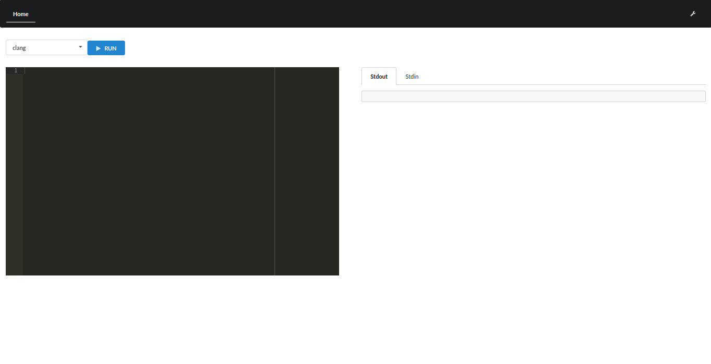

# Salieri

---

# About

The service receives a some programs, compiles and run the program inside LXC Container, then return the output.



# Setup

## LXD

```bash
$ sudo apt-get install lxd
$ newgrp lxd
$ sudo lxd init
$ lxc launch images:debian/stretch <ContainerName>
$ lxc exec <ContainerName> /bin/bash
(Container)$ apt-get install gcc clang build-essential
```

# Play

```
(backend) $ ./server # or go run server.go
```

```
(frontend) $ npm start
```

# Issue

- Supoort other languages
- Logging to DB
